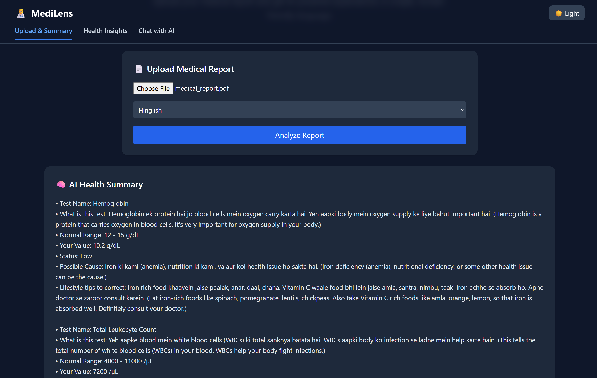
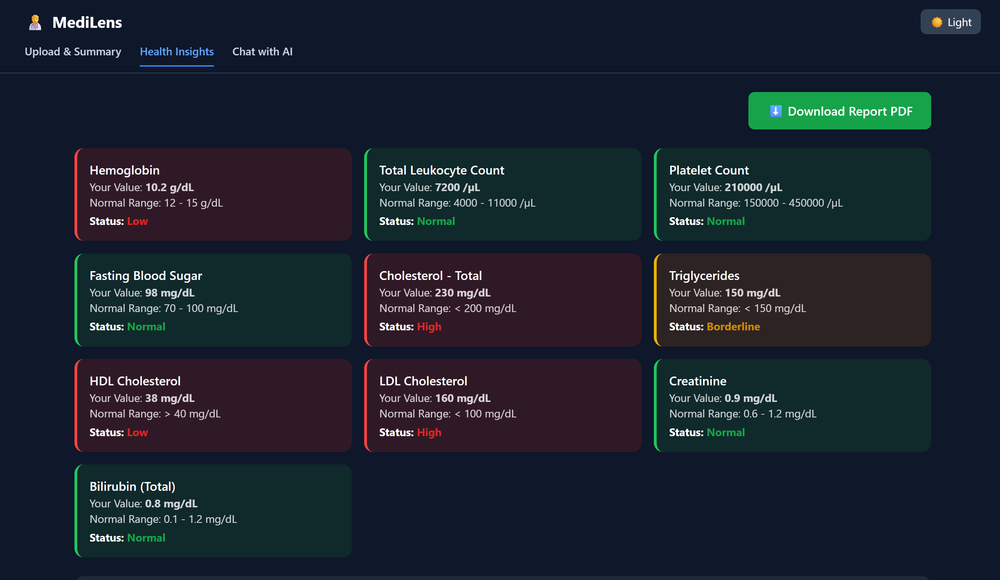
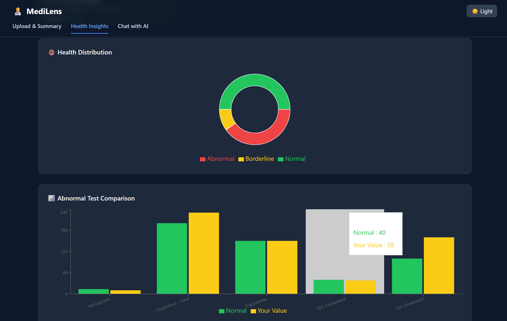
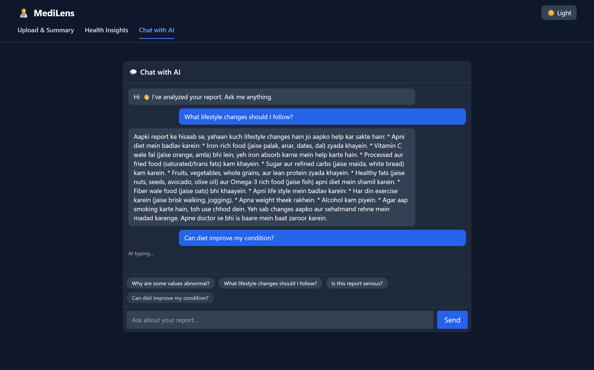

# 🩺 MediLens – AI Health Report Analyzer

MediLens is a full-stack AI-powered web application that helps users understand medical reports in a simple and human-friendly way.  
Users can upload medical PDF reports, receive AI-generated explanations, and interact with the report using a chat-based interface.

---

## 🌐 Live Demo

- **Frontend (Vercel)**  
  https://medilens-ai-health-report-analyzer-dhdbheyn7.vercel.app

- **Backend (FastAPI – Railway)**  
 Deployed on Railway

> ⚠️ **Note:**  
> The live demo uses a limited API quota.  
> If the AI analysis or chat does not respond due to API limits, please refer to the screenshots and feature descriptions below for a complete overview of the project.

---

## ✨ Features

### 📄 Upload & Analyze Medical Reports
- Upload medical report PDFs
- Automatic extraction & AI-based analysis
- Supports **English, Hindi & Hinglish**

### 📊 Health Insights & Visualizations
- Highlights abnormal test values
- Easy-to-understand medical summaries
- Charts and visual indicators for better clarity

### 💬 Chat with AI
- Ask follow-up questions about your report
- Suggested health-related questions
- Context-aware AI responses based on the uploaded report

### 🌗 Light / Dark Mode
- Toggle between Light and Dark themes
- Fully responsive UI
- Mobile-friendly design

---

## 🛠️ Tech Stack

### Frontend
- ⚛️ React (Create React App)
- 🎨 Tailwind CSS
- 🌐 JavaScript (Fetch API)
- 🚀 Deployed on Vercel

### Backend
- ⚡ FastAPI (Python)
- 🍃 MongoDB Atlas
- 🧩 PyMongo
- 🤖 Google Gemini API (LLM)
- 🚄 Deployed on Railway

---

## 📸 Screenshots

### 📄 Upload Medical Report & AI Summary
Upload a medical report PDF and get an AI-generated simplified summary.

### 🧪 Health Indicators & Abnormal Values
Automatically detected abnormal test values with clear indicators.

### 📊 Health Insights & Visual Explanation
Detailed health insights presented in an easy-to-understand format.

### 💬 Chat with AI (Follow-up Questions)
Ask personalized follow-up questions and get context-aware AI responses.

---

## ⭐ Acknowledgements

- Inspired by real-world healthcare challenges and AI-powered applications.
- Thanks to open-source tools and frameworks that made this project possible.

---

## 📌 Future Improvements

- User authentication and personalized report history
- Support for more medical report formats
- Enhanced visual analytics & dashboards
- Doctor-mode recommendations
- Multilingual expansion
- Improved AI accuracy with fine-tuning

---

⭐ If you find this project useful, feel free to star the repository!

