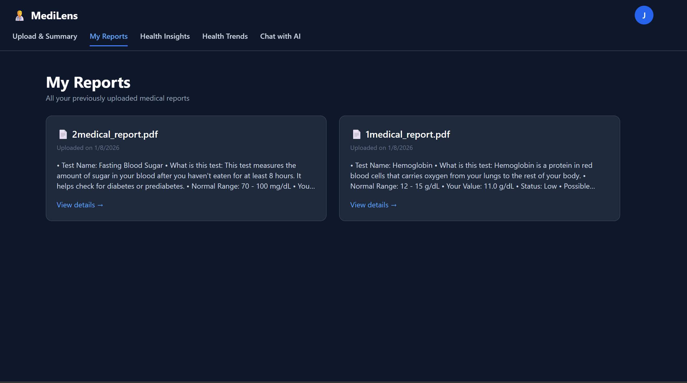
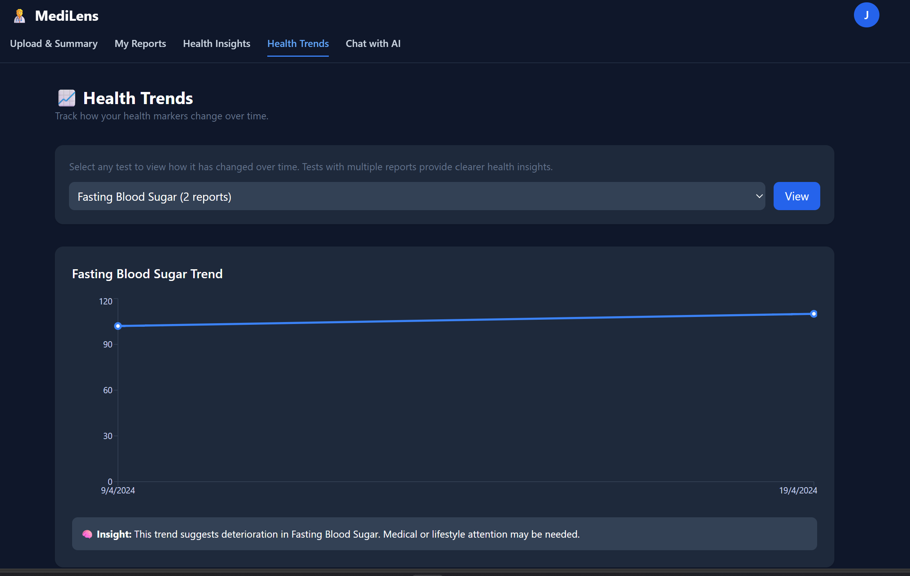
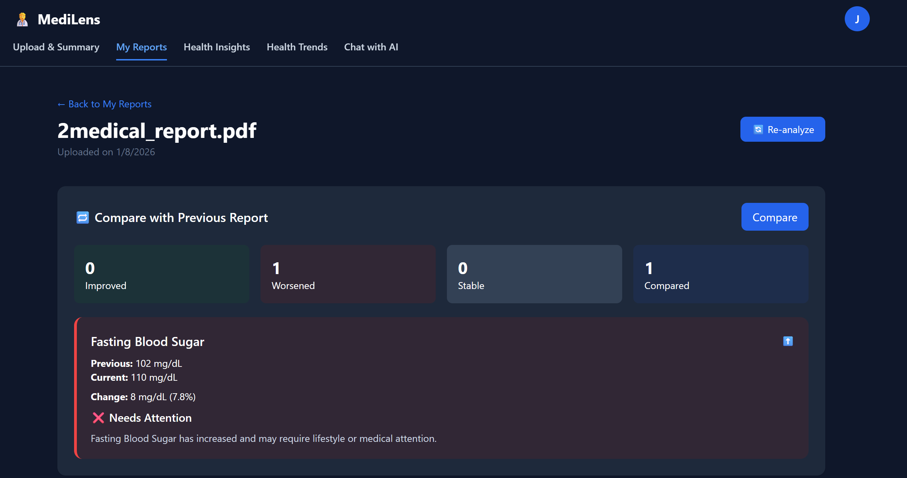

# 🩺 MediLens – AI Health Report Analyzer

MediLens is a full-stack AI-powered healthcare application that helps users understand medical reports in a simple and human-friendly way.

Users can upload medical PDF reports, extract report data using OCR, receive AI-generated explanations, visualize health insights, compare reports over time, track health trends, and interact with their reports through a context-aware AI chat assistant.

---

## 🌐 Live Demo

- **Frontend (Vercel)**  
  https://medilens-ai-health-report-analyzer.vercel.app

- **Backend (FastAPI – Render)**  
  Deployed on Render

---

# ✨ Features

## 📄 Upload & Analyze Medical Reports

- Upload medical report PDFs (up to **10 MB**)
- OCR support for scanned reports using **PyTesseract**
- Automatic text extraction using **PyMuPDF**
- AI-powered report analysis using **Google Gemini**
- Supports **English, Hindi & Hinglish**
- Processes **6+ medical report categories**
  - CBC
  - Lipid Profile
  - Liver Function Test (LFT)
  - Kidney Function Test (KFT)
  - Diabetes
  - Vitamins
- Automatically extracts and tracks **20+ clinical biomarkers**

---

## 🧠 AI Health Summary

- AI-generated simplified medical explanations
- Normal range interpretation
- Patient value explanation
- Health status detection
- Possible causes
- Lifestyle recommendations

---

## 📊 Health Insights & Visualizations

- Highlights abnormal, borderline and normal values
- Easy-to-understand medical summaries
- Health distribution visualization
- Interactive comparison charts
- Compare report values against normal ranges
- Download analyzed report as PDF

---

## 📈 Health Trends

Track health parameters across multiple reports.

Features include:

- Trend visualization across historical reports
- Improvement detection
- Worsening detection
- Stable parameter detection
- Historical health tracking
- Trend analysis for **20+ biomarkers**

---

## 🔄 Report Comparison

Compare the latest report with previously uploaded reports.

Features include:

- Previous vs Current values
- Percentage change
- Improved parameters
- Worsened parameters
- Stable parameters
- Automatic health insights

---

## 💬 Chat with AI

- Ask follow-up questions about uploaded reports
- Suggested health-related prompts
- Lifestyle recommendations
- Report explanations
- Context-aware AI responses
- Personalized answers based on report data

---

## 👤 User Dashboard

- JWT Authentication
- Secure Login & Signup
- Protected APIs
- Argon2 Password Hashing
- Persistent report history
- View previously uploaded reports
- Re-analyze reports anytime

---

## 🌗 Light / Dark Mode

- Toggle between Light and Dark themes
- Fully responsive UI
- Mobile-friendly design
- Clean dashboard experience

---

# 🛠️ Tech Stack

## Frontend

- ⚛️ React (Create React App)
- 🎨 Tailwind CSS
- 🌐 JavaScript (Fetch API)
- 📊 Chart.js
- 🔄 React Router
- 🚀 Deployed on Vercel

---

## Backend

- ⚡ FastAPI (Python)
- 🍃 MongoDB Atlas
- 🧩 PyMongo
- 🤖 Google Gemini API
- 📄 PyMuPDF
- 🔍 PyTesseract OCR
- 🔐 JWT Authentication
- 🛡️ Argon2 Password Hashing
- 🚄 Deployed on Render

---

# 📸 Screenshots

## 📄 Upload Medical Report & AI Summary

Upload a medical report PDF and receive an AI-generated simplified summary.

---

## 🧪 Health Indicators & Abnormal Values

Automatically detects abnormal values with clear visual indicators.

---

## 📊 Health Insights & Visual Explanation

Interactive charts and detailed health insights.

---

## 💬 Chat with AI

Ask personalized follow-up questions and receive context-aware AI responses.

---

## 📂 My Reports

Secure report history with AI summaries for previously uploaded reports.

---

## 📈 Health Trends

Track changes across multiple reports and visualize trends for health parameters over time.

---

## 🔄 Automatic Report Comparison

Compare current and previous reports with automatic improvement, worsening and stability detection.

---

## ⭐ Acknowledgements

- Inspired by real-world healthcare challenges and AI-powered applications.
- Thanks to open-source tools and frameworks that made this project possible.

---

## 📌 Future Improvements

- Support additional medical report formats
- Doctor dashboard for clinical review
- Medication reminders
- Email notifications
- AI-powered health risk prediction
- Advanced trend analytics
- Fine-tuned medical LLM for improved accuracy

---

## 👋 Connect with Me

I'm always open to feedback, collaboration, and opportunities in software engineering and AI-driven development.

- **Author:** Janvi Arora
- **GitHub:** https://github.com/JanviArora24
- **LinkedIn:** https://www.linkedin.com/in/janvi-arora-7b8299294/

---

⭐ If you enjoyed this project, don't forget to star the repository!
